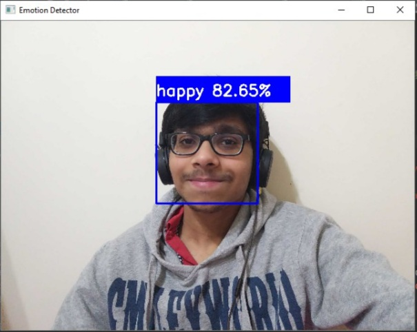

# Emotion-Detector
## Notes
The `requirements.txt` file contains all the dependencies needed for the project.
```
pip install -r requirements.txt
```
## Detecting from images:


## Detecting from web cam:


### How the Network Architecture works:
Stacking conv layers one after the other has more flexibility in expressing non-linear transformations without loosing information. Maxpool removes information from the signal, dropout forces distributed representation, thus both effectively make it harder to propagate information. If, for given problem, highly non-linear transformation has to be applied on raw data, stacking multiple convs (with relu) will make it easier to learn, that's it. 
(src: https://stackoverflow.com/questions/46515248/intuition-behind-stacking-multiple-conv2d-layers-before-dropout-in-cnn)
